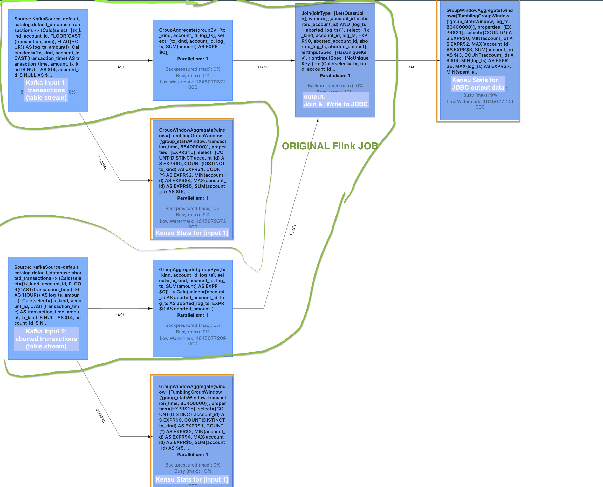

Configuration
-----

The Kensu collector is currently configured via [`flink-conf.yaml` ](./conf/flink-conf.yaml)
(distributed ) and, optionally, ENV variables for Kensu auth info with exception of
ingestion URL/token can be passed either via flink-conf or via env variable, in either case it must be set at least on:
 - `flink client` submitting the job
 - `flink jobmanager`
 - `flink taskmanager` (for datastats)

```
export KENSU_INGESTION_URL=https://sandbox-api.kensuapp.com
export KENSU_AUTH_TOKEN="eyJhbG...."
./build-and-run.sh
```

Open [http://localhost:8082/](http://localhost:8082/) to monitor Flink jobs status

You may modify the stats reporting interval in [./src/main/scala/org/apache/flink/playgrounds/spendreport/SpendReport.scala](./src/main/scala/org/apache/flink/playgrounds/spendreport/SpendReport.scala):
```scala
object SpendReport {
  // the default value of `5.minute` would compute stats over non-overlapping (Tumble) windows of 5 minutes each, taking into account only the  data inside the current window, and would report stats to Kensu at end of each such window
  // note: time window is based on attribute of an input stream, and thus, just as any stream-based group/window computation, to behave properly it requires the timestamp attribute to respect the WATERMARK provided for the input datasources (which is part of original job/stream being monitored by kensu)
  val statsComputeInterval = 1.minute
  ...
}
```

Example: Metadata extraction with Kensu helpers from Flink Table API (on regular Flink)
--------

this patch is not mandatory ( i.e. you can use original Flink)
when using Kensu helpers `kensuMarkStatsInput` and `kensuExecuteInsert`:
  ```scala
  // read original data
tEnv
        .from("Orders")
        .select($("id", "mydata", "rowtime"))
        // optionally add kensu input stats monitoring
        .kensuMarkStatsInput(
          timeWindowGroupExpression = Tumble.over(1.hour).on($"rowtime"),
          countDistinctCols         = Array[String]("id", "mydata") // [optional]
        )
        // you can add any Flink Table API transformations in between including JOINS etc ...
        .filter($"mydata".isNotNull)
        // finally replace .executeInsert("spend_report") with kensuExecuteInsert:
        .kensuExecuteInsert(
          "spend_report",
          outStatsTimeWindowExpr = Some(Tumble.over(1.day()).on($"log_ts"))
        )
  ```

**How it works?**

With the above helper functions used, it starts the original Flink job, 
as long with Kensu input/output datastats computation/reporting tasks. 

The whole thing is collapsed into a single Flink stream job, i.e. input data is read and result is computed only once,
forwarding the data to kensu tasks.

The current prototype supports only Kafka inputs (via Table API) and JDBC/MySQL outputs
`.executeInsert()` replaced by `.kensuExecuteInsert()`).
More connectors can be added rather easily/quickly.




Fully automatic metadata extraction (only for CDH Flink, unfinished prototype)
--------

What it can do:
- extract `Input` and `Output` `datasources`/`schemas` fully automatically without modifying customer job (though,
  parts of this extraction are limited as `Flink` do not seem to expose all original tree to `FlinkHooks`,
  only some limited low level tree) *(not fully implemented and less tested for Flink 0.14)*
- input and output datastats are at the moment still supported only via extra code, see `kensuMarkStatsInput` above


*Changes from original playground provided by flink:*

- We patched original `Flink` docker images with `Cloudera` distro/uberjar of `Flink`,
  which contain slightly better interface to extract lineage automatically without modifying Flink job code.
  However, it's not required to use `Cloudera's Flink` when using the Kensu helper functions (see sections above).

Building Docker...
--------

Builds are done inside docker, so minimal setup is needed.

Just run [./build-and-run.sh](./build-and-run.sh) to build docker images and start up the flink cluster inside
Docker-Compose (incl. Kafka, MySQL, Flink `jobmanager` & `taskmanager`, and `flink client` to submit the sample job)

~~then, you may try to reload only the custom flink sample job (without whole "cluster")
[./quick-run.sh](./quick-run.sh), however, it seem to not always work~~


Local dev with IntelliJ
------

while the whole Flink app is running, run the following to obtain Kensu collector jar and place it in `./lib` to get
discovered by Maven.

```bash
mkdir ./lib/
docker cp table-walkthrough_jobmanager_1:/opt/flink/lib/kensu-flink-collector.jar ./lib/
```
then load this maven project in IntelliJ
